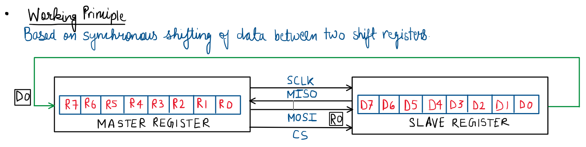
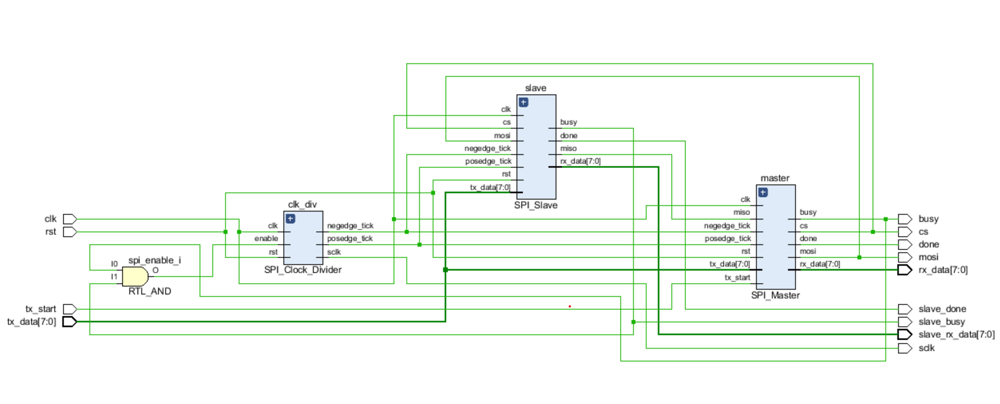
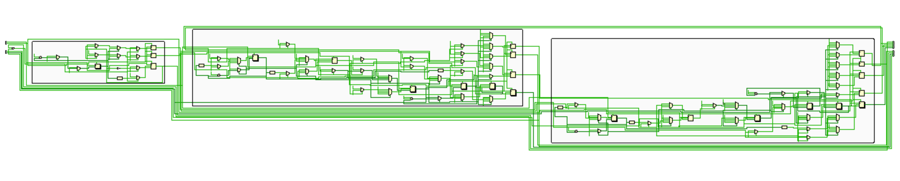
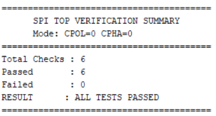
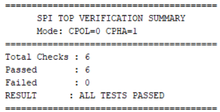
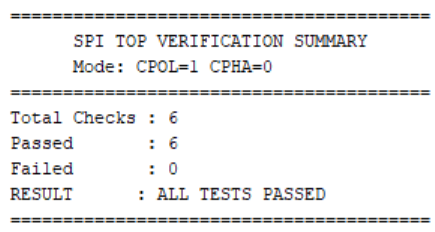
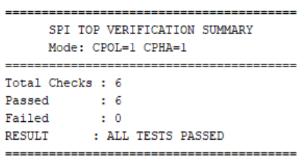

# Parameterised SPI Controller

## 1. Overview
The SPI Controller is a parameterised Verilog implementation of the Serial Peripheral Interface (SPI) protocol. It consists of configurable **Master**, **Slave**, and **Clock Divider** modules, supporting all four SPI modes (0–3) through programmable Clock Polarity (`CPOL`) and Clock Phase (`CPHA`) parameters.

## 2. Features 
- Single Master–Single Slave architecture.
- Full-duplex synchronous communication.
- Supports all four SPI modes (0–3).
- Parameterised data width and SPI clock frequency.
- Self-checking verification with end-to-end loopback testing.

## 3. Working Principle

The SPI Controller operates using a single Master and a single Slave communicating over four signals:

- **SCLK** – Serial Clock generated by the Clock Divider under Master control.
- **MOSI** – Master Out, Slave In data line.
- **MISO** – Master In, Slave Out data line.
- **CS** – Active-low Chip Select used to enable the Slave.

<div align = "center">



</div>

During a transaction, the Master asserts **CS**, enables the Clock Divider to generate the serial clock, and simultaneously transmits and receives one bit per clock cycle. Since this implementation uses an **8-bit data width**, each transaction requires 8 SPI clock cycles to complete. The sampling and shifting edges are determined by the selected SPI mode (CPOL/CPHA).

## 4. Repository Structure

```text
SPI_Controller/
│
├── src/
│   ├── SPI_Clock_Divider.v
│   ├── SPI_Master.v
│   ├── SPI_Slave.v
│   └── SPI_TOP.v
│
├── tb/
│   ├── SPI_Clock_Divider_tb.v
│   ├── SPI_Master_tb.v
│   ├── SPI_Slave_tb.v
│   └── SPI_TOP_tb.v
│
├── images/
│   ├── diagram.png
│   ├── RTL_schematic.png
│   ├── RTL_zoomed.png
│   ├── mode0.png
│   ├── mode1.png
│   ├── mode2.png
│   └── mode3.png
│ 
├── waveforms/
│   ├── clk_div_waveform.png
│   ├── master_waveform.gif
│   ├── slave_waveform.gif
│   └── waveform_summary.gif
│
├── README.md
├── VERIFICATION.md
└── LICENSE
```

## 5. Configuration Parameters

| Parameter | Description | Default |
|:-----------:|:-------------:|:---------:|
| `DATA_WIDTH` | Number of bits transferred per transaction | 8 |
| `CLK_FREQ` | System clock frequency | 100 MHz |
| `SPI_FREQ` | SPI serial clock frequency | 1 MHz |
| `CPOL` | Clock Polarity | 0 |
| `CPHA` | Clock Phase | 0 |

## 6. SPI Modes

- **CPOL (Clock Polarity)** – Determines the idle state of the serial clock (`SCLK`). A value of **0** keeps the clock low when idle, while **1** keeps it high. <br>

- **CPHA (Clock Phase)** – Determines on which clock edge data is sampled and on which edge it is shifted, ensuring proper synchronization between the Master and Slave. <br>

- **Sample Edge –** Clock edge used to read incoming data. <br>

- **Shift Edge –** Clock edge used to transmit the next data bit.

| Mode | CPOL | CPHA | Idle Clock | Sample Edge | Shift Edge |
|:----:|:----:|:----:|:----------:|:-----------:|:----------:|
| 0 | 0 | 0 | Low | Rising | Falling |
| 1 | 0 | 1 | Low | Falling | Rising |
| 2 | 1 | 0 | High | Falling | Rising |
| 3 | 1 | 1 | High | Rising | Falling |

## 7. Module Description

| Module | Description |
|:--------:|-------------|
| **SPI Clock Divider** | Generates the SPI serial clock (**SCLK**) from the system clock and produces **posedge** and **negedge** tick signals for data synchronization. |
| **SPI Master** | Controls SPI communication by asserting **CS**, transmitting data on **MOSI**, and receiving data on **MISO**. |
| **SPI Slave** | Responds to Master transactions by receiving data from **MOSI** while simultaneously transmitting data over **MISO**. |
| **SPI TOP** | Integrates the Clock Divider, Master, and Slave modules into a complete SPI communication system for end-to-end operation and verification. |

## 8. Verification 

> [!NOTE]
> A detailed verification report covering the verification methodology, test cases, waveform analysis, debugging process, and final results is documented in [VERIFICATION.md](https://github.com/theYash856/Parameterised_SPI_Controller/blob/main/VERIFICATION.md)

## 9. Simulation & Results 

### 9.1. RTL Schematic

#### Top View

<div align = "center">



</div>

#### Expanded View

<div align = "center">



</div>

### 9.2. Integrated SPI Controller Waveform

<div align="center">


</div>

### 9.3. Verification Summary

The complete verification suite was executed for all four SPI modes by varying the **CPOL** and **CPHA** parameters. All functional test cases passed successfully in each configuration.

<table>
  <tr>
    <th>Mode 0<br>(CPOL = 0, CPHA = 0)</th>
    <th>Mode 1<br>(CPOL = 0, CPHA = 1)</th>
    <th>Mode 2<br>(CPOL = 1, CPHA = 0)</th>
    <th>Mode 3<br>(CPOL = 1, CPHA = 1)</th>
  </tr>
  <tr>
    <td></td>
    <td></td>
    <td></td>
    <td></td>
  </tr>
</table>


## 10. Key Learnings
- Gained practical experience in designing configurable RTL for synchronous serial communication protocols such as SPI.
- Understood how Clock Polarity (CPOL) and Clock Phase (CPHA) affect data sampling and shifting in SPI communication. 
- Strengthened RTL verification skills by debugging signal synchronization and testbench sequencing issues.

## 11. Tools & Concepts Used

**Language:** Verilog HDL

**EDA Tools:** Xilinx Vivado (Simulation and RTL analysis). The design is also compatible with online EDA platforms.

**New Concepts Explored:** Synchronous Serial Communication, Parameterised RTL Design, Clock Polarity (CPOL), Clock Phase (CPHA), and RTL Timing Verification.
