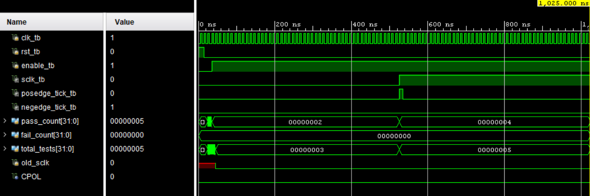
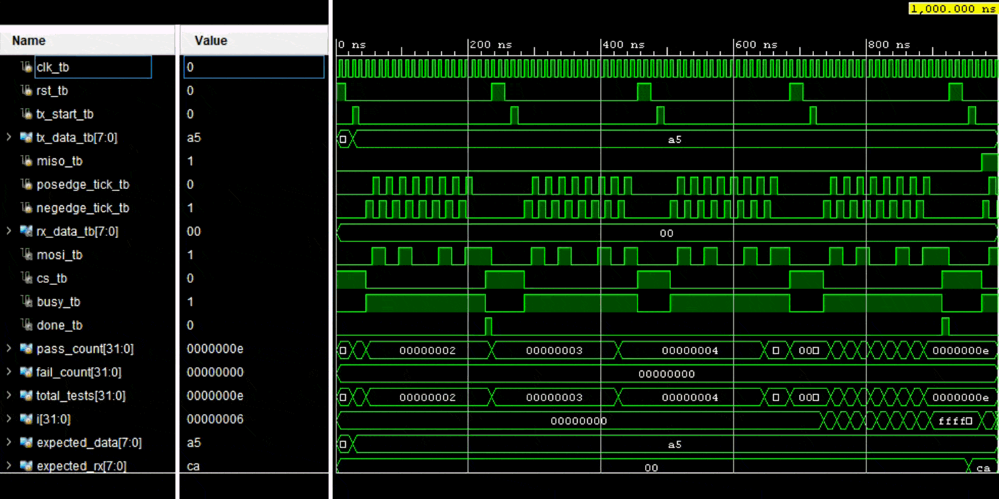

# SPI Controller Verification

## 1. Verification Objective

The primary objective of this verification document is to demonstrate that the SPI Controller functions as intended by verifying the required functionality, normal operating conditions, and relevant edge cases. This includes validating the SPI Clock Divider, SPI Master, SPI Slave, and the integrated SPI TOP module.

A secondary objective was to strengthen RTL verification skills by developing structured, task-based self-checking testbenches and gaining practical debugging experience throughout the design and verification process.

## 2. Testbench Architecture

Dedicated testbenches were developed for the following modules:
- `SPI_Clock_Divider_tb`
- `SPI_Master_tb`
- `SPI_Slave_tb`
- `SPI_TOP_tb`

Each testbench follows a common verification architecture consisting of:

- Clock and reset generation
- DUT instantiation
- Input stimulus generation
- Output monitoring (`$monitor`)
- Waveform dumping (`$dumpfile`, `$dumpvars`)
- Reusable driver and checker tasks
- Automated self-checking with PASS/FAIL reporting and a verification summary

## 3. Verification Methodology

The SPI Controller was verified using a bottom-up approach, where each module was validated independently before verifying the complete integrated design.  
The following sections summarise the functional test cases executed for each module along with their verification results.

## 4. Test Cases

>[!NOTE]
> The testbench is parameterized by `CPOL` and `CPHA`, allowing the complete verification suite to be executed for all four SPI modes (Mode 0–3) by changing the parameter values.

### 4.1. SPI Clock Divider

| Test ID | Test Case | Purpose | Result |
|:------:|:------------:|----------|:------:|
| CD-01 | Reset Verification | Verify SCLK returns to its idle state (CPOL) and both edge tick signals remain deasserted after reset. | ✅ Pass |
| CD-02 | Idle Verification | Verify the Clock Divider remains idle with SCLK at the configured idle level when disabled. | ✅ Pass |
| CD-03 | Clock Generation | Verify the SPI serial clock (SCLK) is generated when the Clock Divider is enabled. | ✅ Pass |
| CD-04 | Positive Edge Tick | Verify the `posedge_tick` pulse is asserted only on each rising edge of SCLK. | ✅ Pass |
| CD-05 | Negative Edge Tick | Verify the `negedge_tick` pulse is asserted only on each falling edge of SCLK. | ✅ Pass |

## 4.2. SPI Master 

| Test ID | Test Case | Purpose | Result |
|:------:|:------------:|----------|:------:|
| M-01 | Reset Verification | Verify default outputs after reset. | ✅ Pass |
| M-02 | Start Transfer | Verify a transaction begins correctly with `Busy` asserted and `CS` driven low. | ✅ Pass |
| M-03 | Transaction Complete | Verify the transaction completes successfully. | ✅ Pass |
| M-04 | Busy Flag Verification | Verify the `Busy` signal remains asserted throughout the data transfer. | ✅ Pass |
| M-05 | Chip Select Verification | Verify `CS` remains active during the transaction and returns inactive after completion. | ✅ Pass |
| M-06 | MOSI Shift Verification | Verify the transmitted bit sequence on `MOSI` matches the expected data for the selected SPI mode. | ✅ Pass |
| M-07 | MISO Receive Verification | Verify serial data received on `MISO` is correctly reconstructed into the receive register. | ✅ Pass |
| M-08 | Back-to-Back Transfers | Verify consecutive SPI transactions execute correctly without requiring a DUT reset between transfers. | ✅ Pass |

### 4.3. SPI Slave

| Test ID | Test Case | Purpose | Result |
|:------:|:-----------:|---------|:------:|
| S-01 | Reset Verification | Verify outputs and internal state after reset. | ✅ Pass |
| S-02 | Start Transfer | Verify the Slave enters the transfer state when `CS` is asserted. | ✅ Pass |
| S-03 | Transaction Complete | Verify the transaction completes successfully after `CS` is released. | ✅ Pass |
| S-04 | Busy Flag Verification | Verify `busy` remains asserted throughout the active transfer. | ✅ Pass |
| S-05 | Busy Status Verification | Verify `busy` remains asserted during transfer and clears after `CS` is deasserted. | ✅ Pass |
| S-06 | MISO Shift Verification | Verify transmit data is shifted correctly onto the `MISO` line for the selected SPI mode. | ✅ Pass |
| S-07 | MOSI Receive Verification | Verify serial data received on `MOSI` is reconstructed correctly. | ✅ Pass |
| S-08 | Back-to-Back Transfers | Verify consecutive SPI transactions execute correctly without requiring a reset. | ✅ Pass |

> [!NOTE]
> The transmit and receive verification tests (S-06 & S-07) are complementary to those in the SPI Master. Since the signal directions are reversed, the **MOSI** and **MISO** verification tests are correspondingly interchanged:
> - **MISO Shift Verification** validates data transmitted by the Slave.
> - **MOSI Receive Verification** validates data received by the Slave.

### 4.4. SPI TOP 

| Test ID | Test Case | Purpose | Result |
|:------:|:------------:|-------------|:------:|
| T-01 | Reset Verification | Verify that both Master and Slave initialize correctly and all outputs return to their idle state after reset. | ✅ Pass |
| T-02 | Start Transfer | Verify that the Master asserts **CS** and both FSMs enter the transfer state when a transaction is initiated. | ✅ Pass |
| T-03 | End-to-End Loopback | Verify successful bidirectional data transfer between the integrated Master and Slave modules. | ✅ Pass |
| T-04 | Both FSMs Complete Together | Verify that both FSMs complete the transaction simultaneously, asserting `done` and clearing `busy` together. | ✅ Pass |
| T-05 | First Back-to-Back Transfer | Verify successful completion of the first consecutive SPI transaction. | ✅ Pass |
| T-06 | Second Back-to-Back Transfer | Verify successful completion of a second consecutive transaction without requiring a reset. | ✅ Pass |

> [!NOTE]
> The `SPI_TOP` module exposes the Slave outputs (`slave_rx_data`, `slave_busy`, and `slave_done`) solely for verification purposes. These are **not** standard SPI interface signals. They are made available because the Master and Slave are instantiated within the same top-level module, allowing the testbench to independently verify both modules during end-to-end integration testing.

## 5. Waveform Analysis

### 5.1. SPI Clock Divider Waveform

Demonstrates SPI clock generation from the system clock, including the corresponding positive and negative edge tick signals used for data synchronization.

---

### 5.2. SPI Master Waveform

Illustrates the Master's state transitions, Chip-Select control, serial data transmission over **MOSI**, data reception through **MISO**, and transaction completion.

---

### 5.3. SPI Slave Waveform

Illustrates the Slave's response to the Master's transaction, including serial data reception on **MOSI**, transmission on **MISO**, and internal state transitions.

---

### 5.4. Integrated SPI Controller Waveform

Shows a complete end-to-end SPI transaction, including Clock Divider operation, Master–Slave synchronization, full-duplex data transfer, and successful transaction completion.

## 6. Verification Results

| Module | Test Cases | Verification Checks | Result |
|:--------|:----------:|:-----------------:|:------:|
| SPI Clock Divider | 5 | 5 | ✅ Pass |
| SPI Master | 8 | 17 | ✅ Pass |
| SPI Slave | 8 | 17 | ✅ Pass |
| SPI TOP | 6 | 6 | ✅ Pass |

> [!NOTE]
> Some test cases perform multiple automated self-checks. For example, the **MOSI/MISO Shift Verification** test validates every transmitted bit individually rather than treating the entire transfer as a single check. As a result, the total number of functional checks is greater than the number of test cases.

## 7. Debugging Experience

### 7.1. First-Bit Transmission (CPHA = 0)

One of the most challenging issues occurred in the SPI Master while implementing **CPHA = 0** operation. Although the remaining bits were transmitted correctly, the first bit was never placed on the output before the initial sampling edge, causing every transfer to start with incorrect data.

**Root Cause**

In CPHA = 0, the first data bit must already be present on the serial output before the first sample edge. The transmit shift register was loaded correctly, but the first output bit was not preloaded onto the transmission line.

**Resolution**

The first transmit bit was explicitly preloaded during the `LOAD` state before entering the transfer state. Separate handling was maintained for CPHA = 0 and CPHA = 1 since their first-bit timing requirements differ.

**Key Learning**

Understanding protocol timing is as important as implementing the protocol logic itself. Small differences in edge timing can completely change the behaviour of a communication interface.

### 7.2. Testbench Timing Synchronization

The most time-consuming debugging effort involved synchronizing the verification environment with the DUT. In many cases, the RTL implementation was functionally correct, but the verification checks were performed before the design outputs had updated.

**Root Cause**

Driver tasks, SPI clock-edge generation, and verification checks were not perfectly aligned with the DUT's sequential logic. Several failures were caused by simulation scheduling rather than incorrect RTL functionality.

**Resolution**

Carefully synchronized stimulus and verification using `@(posedge clk)` where required. Introduced small simulation delays (`#1`) after SPI edge generation before checking outputs, ensuring signals had propagated and settled. Refined the ordering of driver tasks and verification checks until they accurately reflected the expected hardware behavior.

**Key Learning**

RTL verification requires precise synchronization between stimulus, clock events, and signal observation. Correct logic can appear to fail if verification is performed even one simulation step too early.

### 7.3. CS-Driven Engagement Race Condition

While integrating the Master and Slave in `SPI_TOP`, `T-04` intermittently failed because `slave_busy` remained high for one extra clock cycle even after the Slave had returned to the `IDLE` state.

**Root Cause**  

The Slave entered the `LOAD` state based on the value of `CS`. Although the next-state logic correctly prevented a transfer when `CS` was released, the output logic in the `LOAD` state still asserted `busy` for one clock cycle. This caused a temporary mismatch between the Slave's state and its output signals.

**Resolution**  

Added the same `CS` condition inside the `LOAD` state's output logic so that both the state transition and output signals are controlled by the same condition.

**Key Learning**  

State transition logic and output logic should use the same control conditions. Otherwise, they can become temporarily out of sync, leading to subtle one-clock-cycle timing issues that are often only revealed during integration testing.

## 8. Conclusion

The SPI Controller was successfully designed and verified using dedicated module-level and system-level self-checking testbenches. Verification covered the SPI Clock Divider, Master, Slave, and integrated SPI TOP modules, including functional operation, protocol timing, and end-to-end communication.

Throughout the verification process, particular emphasis was placed on **validating timing-sensitive behavior** across different SPI modes and debugging synchronization issues between the DUT and the verification environment.

Overall, the project provided practical experience in designing configurable RTL, implementing timing-sensitive serial communication, and developing structured self-checking verification environments for protocol-level digital systems.
